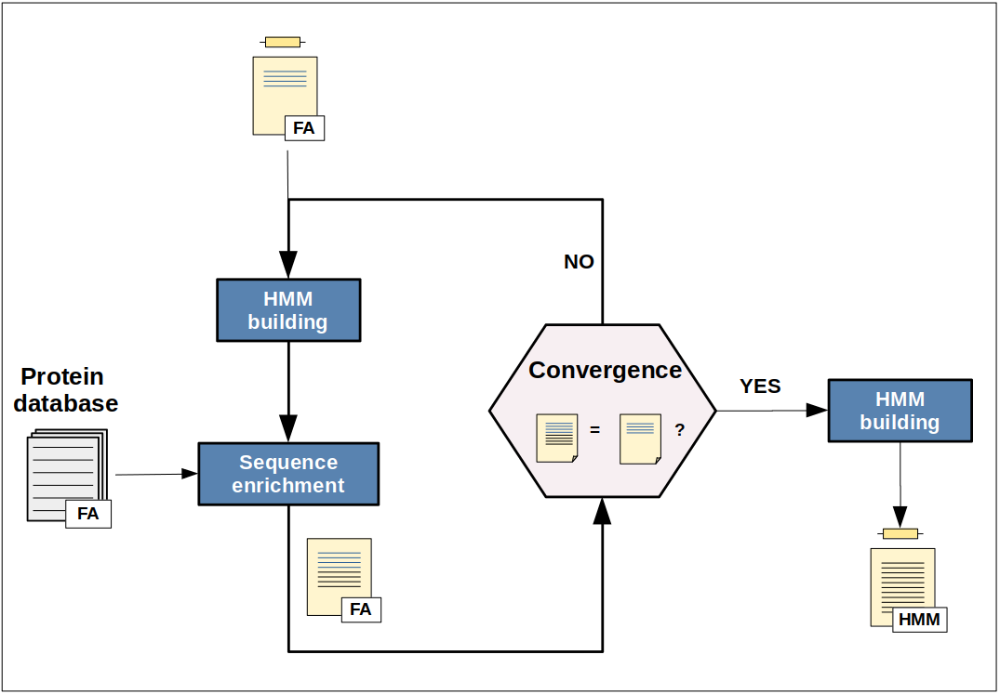

# Overall procedure
<figure class="fig-iterhmmbuild">
    
    <figcaption>
<b>Figure 2: Pipeline overview of IterHMMBuild</b> 
    </figcaption>
</figure>

IterHMMBuild is an iterative search method based on the hmmer program, the aim of which is to provide users with a representative HMM protein profile of interest constructed by an iterative enrichment process starting from a small initial set of related protein sequences.

The IterHMMBuild procedure starts building an HMM profile from either a set of related protein sequences or a single query sequence. This initial profile is then used to identify homologous sequences in any user-specified protein sequence database. If sequences are found, they are added to the initial query sequences and a new HMM profile model is built. This process is repeated until no new sequences are found (i.e. convergence is reached).

## IterHMMBuild procedure step by step

### Inputs
Two inputs are required for IterHMMBuild.

The first input is either a fasta file with at least one protein sequence  (<a href="#overall-procedure">Figure 2</a>) OR a directory location where multiple individual fasta files are stored (<a href="./index.html#fig-1">Figure 1</a>). In the first case, the output will contain an HMM profile representative of the sequences in the fasta file given as input; if a directory is given as input then the HMM profile in the output will be a concatenation of HMM profiles, each corresponding to the fasta files present in the directory.

The second input is a fasta file of protein database used to enrich initial protein sequence(s) of interest.

### HMM building step

<figure>

</figure>

The HMM building is a two-step procedure: a multiple sequence alignment is performed on the input sequences using muscle and the hmmbuild command from hmmer is then used to build the HMM profile from this alignment. However, note that at the first iteration the usearch command is performed on the input sequences to ensure that thoses sequences share no more than 90% (default value) of identity.

### Sequence enrichment step
The previously built HMM profile is searched against the protein database given as input. All matching sequences with a E-values a less than 0.01 (default value) and an expected accuracy per residue of the alignment b above or equal to 0.6 (default value) are retrieved. Those sequences are then merged to the initial input sequences. To ensure that sequences are not redundant, usearch is applied with a threshold identity value of 0.90.

    

        Note
    

    <ul class="last">
        <li class="note-ref">a Both conditional and independent E-values from hmmer are evaluated</li>
        <li class="note-ref">b Please see the <a href="http://eddylab.org/software/hmmer3/3.1b2/Userguide.pdf">hmmer documentation</a> for more details about the accuracy</li>
    </ul>

### Convergence
Basically, the convergence is reached when the number of sequences at iteration i+1 (Nseqi+1) is equal to the number of sequences at iteration i (Nseqi). However, Nseqi+1 can sometimes be below than Nseqi. Thus, to ensure that the pipeline does not run indefinitely, a counter is incremented each time the absolute difference between Nseqi+1 and Nseqi is less or equal to 1 (default value). The convergence is then also reached when the value of this counter is equal to 3 (default value).

### Outputs
An example output is as shown below:

<pre><b>iterhmmbuild_2020-10-29_13-13-04/</b>
├── X.hmm
├── X_seed.clw
├── X_seed.fa
├── info.log
├── <b>iter_1</b>
│   ├── X_enriched_nr.fasta
│   ├── X_nr.clw
│   ├── X_nr.domtblout
│   ├── X_nr.fa
│   └── X_nr.hmm
├── <b>...</b>
└── <b>iter_6</b>
    ├── X_enriched_nr.clw
    ├── X_enriched_nr.domtblout
    ├── X_enriched_nr.fasta
    └── X_enriched_nr.hmm
</pre>

The table below describes the content of the output directory:

<table class="mytable">
    <tr>
        <th class="t-header">File name</th>
        <th class="t-header">Description</th>
    </tr>
    <tr>
        <td class="t-data">A.hmm</td> 
        <td class="t-data">Final HMM profile</td> 
    </tr>
    <tr>
        <td class="t-data">A_seed.fa</td> 
        <td class="t-data">Final sequences used to build A.hmm</td> 
    </tr>
    <tr>
        <td class="t-data">A_seed.clw</td> 
        <td class="t-data">Multiple alignment (clustal W format) of A_seed.fa</td> 
    </tr>
    <tr>
        <td class="t-data">info.log</td> 
        <td class="t-data">Log summary of the computation</td> 
    </tr>
    <tr>
        <td class="t-data">iter_1/A_nr.fa</td> 
        <td class="t-data">Non redundant sequences coming from usearch applied on the input A.fa 
        (see <a href="./ihb_introduction.html#hmm-building-step">IterHMMBuild procedure</a>)
        </td>
    </tr>
    <tr>
        <td class="t-data">iter_1/A_nr.clw</td> 
        <td class="t-data">Multiple alignment of sequences in A_nr.fa
        </td>
    </tr>
    <tr>
        <td class="t-data">iter_1/A_nr.hmm</td> 
        <td class="t-data">HMM profile built with A_nr.clw as input
        </td>
    </tr>
    <tr>
        <td class="t-data">iter_1/A_nr.domtblout</td> 
        <td class="t-data">Output file of the hmmsearch command
        </td>
    </tr>
    <tr>
        <td class="t-data">iter_1/A_enriched_nr.fasta</td> 
        <td class="t-data">Non redundant sequences coming from homologous sequences identified
        with hmmsearch and initial sequences in A.fa 
        </td>
    </tr>
</table>
