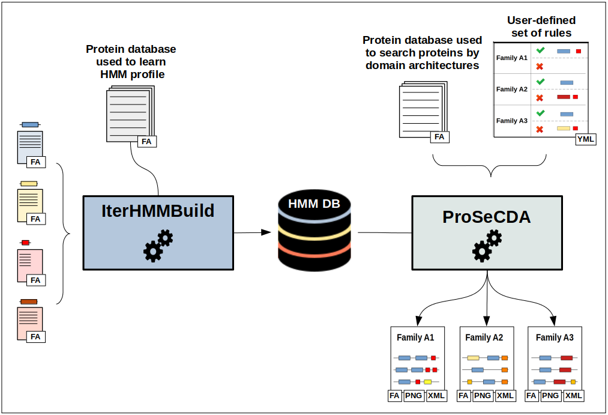

# Welcome to CustomProteinSearch
<figure>
    
    <figcaption>
<b>Figure 1: Overview of the CusProSe package functionalities</b> 
    </figcaption>
</figure>
<!--  -->

CustomProteinSearch is a python package containing two independent but complementary programs whose overall objective is to help users to search for specific proteins of interest based on their domain composition: ** IterHMMBuild ** and ** ProSeCDA **.

<b>IterHMMBuild</b> is an iterative search method based on the hmmer program, the aim of which is to provide users with a representative HMM protein profile of interest constructed by an iterative enrichment process starting from a small initial set of related protein sequences.

<b>ProSeCDA</b> is a tool that allows to search in a given protein database multiple proteins of interest defined by a user-specified set of domains.
